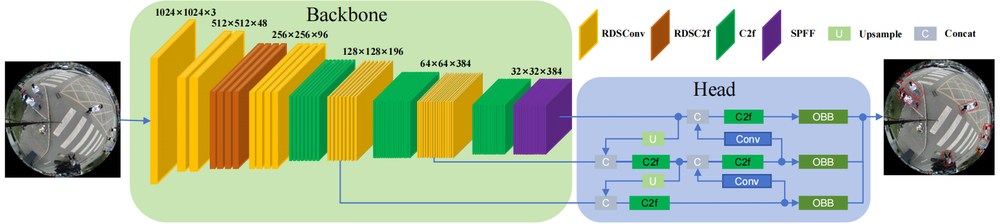
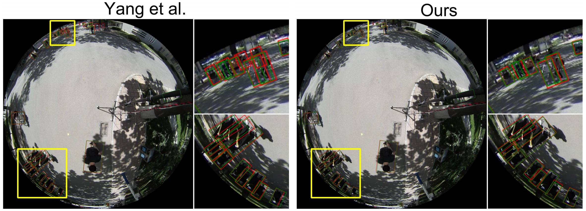
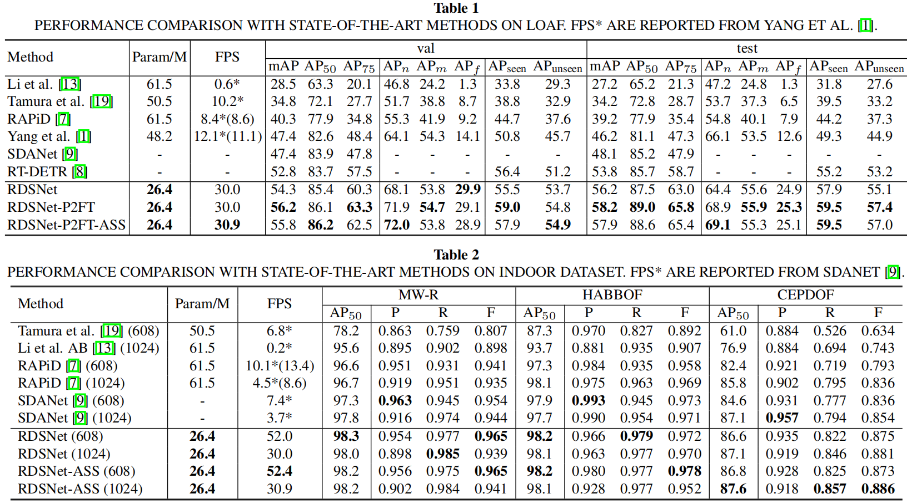

# RDSNet: Efficient Radial-Awere Deformable Sampling Network For Top-View Fisheye People Detection

This repository is the official PyTorch implementation of the [[paper](xxx)]. Our code can reproduce testing results reported in the paper.

RDSNet can achieve **state-of-the-art** performance on four mainstream top-view fisheye datasets(LOAF, MW-R, HABBOF and CEPDOF) with **~50% parameters** and **~2.5× faster inference**, while yielding significant metric improvements.



## 🔥 News

-  Add instructions for evaulation.
-  Add instructions for training.
-  Release MW-R_YOLO dataset.
-  Release pretrained models.
-  RDSNet is accepted to ICASSP 2026!


## 🧠 Overview

Recent progress in object detection has enabled robust performance across various visual scenarios, but top-view fisheye people detection remains a persistent challenge due to inherent rotational symmetry, radial scale distortion, and limited dataset diversity. These issues severely hinder the generalization and efficiency of conventional CNN-based detectors, which struggle to adapt to the unique geometric properties of fisheye imagery and the scarcity of specialized training data. 

To tackle these bottlenecks, we present **RDSNet** (Radial-aware Deformable Sampling Network), an efficient and robust framework tailored for top-view fisheye people detection. At its core, RDSNet incorporates **RDSConv** — a radial-aware deformable sampling convolution that achieves rotation- and scale-equivariant feature extraction through predefined geometric priors and efficient sampling strategies. Complementing this, we introduce **P2FT** (Perspective-to-Fisheye Transformation), a data augmentation technique that converts abundant standard perspective images into realistic top-view fisheye training samples, alleviating dataset scarcity. 

RDSNet integrates seamlessly with mainstream detection backbones (e.g., YOLOv8) without increasing model parameters, enabling efficient deployment. Extensive experiments on **four benchmark datasets (LOAF, MW-R, CEPDOF, HABBOF)** demonstrate that RDSNet: 

- Achieves **state-of-the-art**  and strong generalization
- Runs **2.5× faste**r (30 FPS) with **50% fewer parameters** (26.4M)
- Excels in both indoor and **large-scale outdoor surveillance** scenarios


## 🚀 Performance




## 🛠️ Installation

#### 1.  Clone the Repository

```bash
git clone 
cd RDSNet
```

#### 2.  Install the required Pytorch and Python libraries

```bash
conda create -n RDSNet python=3.10 -y
conda activate RDSNet
pip install torch==1.11.0+cu113 torchvision==0.12.0+cu113 torchaudio==0.11.0 --extra-index-url https://download.pytorch.org/whl/cu113
pip numpy==1.26.4 install tqdm pyyaml opencv-python==4.9.0.80 psutil matplotlib requests scipy pandas seaborn
```

**Note:** 

- Other PyTorch or CUDA versions work for evaluation, but may lead to ineffective training.

- `opencv-python==4.9.0.80` and `numpy==1.26.4` are the recommended fixed versions. Alternative versions are acceptable, as long as the numpy version is less than 2.0.

#### 3.  Install the RDSConv

```bash
sudo apt install cuda-toolkit-11-3 #(also you can try downloading the files to your own directory. if not have permissions.)
export CUDA_HOME=/usr/local/cuda
export PATH=$CUDA_HOME/bin:$PATH
export LD_LIBRARY_PATH=$CUDA_HOME/lib64:$LD_LIBRARY_PATH

cd RDSNet/RDSConv
pip install -v -e . --no-build-isolation
python test.py
```

If test.py runs without errors, the installation is successful.

#### 4. Install the obb_iou calculation function

```bash
cd ..
cd ./ultralytics/utils/cuda_op
pip install -v -e . --no-build-isolation
```


## 📂 Dataset

### 1. Download

- The LOAF dataset can be downloaded from: [LOAF](https://loafisheye.github.io/download.html)

  - Please download [LOAF](https://loafisheye.github.io/download.html) dataset and organize them as following:

  - Organize the dataset in the following directory structure:

    ```
    /path/to/LOAF/
        ├── images
        │   └── resolution_1k
        │       ├── train
        │       ├── val
        │       └── test
        ├── annotations
        │   └── resolution_1k
        │       ├── instances_train.json
        │       ├── ...
        └───────└── instances_test.json
    ```

- The MW-R dataset can be downloaded from: [MW-R](https://drive.google.com/file/d/1IHUep5ULlezZZR6SWqe7gPokhILoVu4U/view?usp=drive_link).

  - We thank the original dataset author **Ma Nuo** for the generous support and for making the MW-R dataset available to this work.

- The CEPDOF dataset can be downloaded from:  [CEPDOF](https://vip.bu.edu/projects/vsns/cossy/datasets/cepdof/)

- The HABBOF dataset can be downloaded from: [HABBOF](https://vip.bu.edu/projects/vsns/cossy/datasets/habbof/)

- The COCO2017 dataset can be downloaded from: [train2017](http://images.cocodataset.org/zips/train2017.zip), [annotations_trainval2017](http://images.cocodataset.org/annotations/annotations_trainval2017.zip)

  - Organize the dataset in the following directory structure:

    ```
    /path/to/COCO2017/
        ├── train2017
        ├── annotations
            └── instances_train2017.json
    ```


### 2. Generate YOLO-Style Dataset

The default dataset directory is `RDSNet/datasets`.  
If you need to change it, we recommend placing all datasets under the same root directory.

```
cd RDSNet
# Configure your dataset download path and output path in dataset_convert2yolo.py
python dataset_convert2yolo.py
```

 

### 3. Configure the YAML files

For each dataset, a corresponding YAML file is provided in `RDSNet/datasets`.  
Please copy the YAML file to the directory where your dataset is located.  
If your dataset is not placed under `RDSNet/datasets`, please modify the paths in the YAML file accordingly.


## 📥 Checkpoint

We release the checkpoint of the model that incorporates all the components proposed in this work, namely **RDSNet-P2FT-ASS**.

Under different training datasets and image sizes used for training and testing, the following versions are provided:

Train in LOAF dataset：[1024 test size](https://drive.google.com/file/d/1ta9WdbJhS3RDBalhYnxrynzBPDZ7E0Nt/view?usp=drive_link)

Train in HABBOF and CEPDOF dataset, test in MW-R dataset:  [608 test size](https://drive.google.com/file/d/1--s20CALdt6riGk17UhPcTc1VebqpZM0/view?usp=drive_link),  [1024 test size](https://drive.google.com/file/d/1bpQA--WWEG6NkiQg0pnaT9rOXRMy4r21/view?usp=drive_link)

Train in MW-R and CEPDOF dataset, test in HABBOF dataset: [608 test size](https://drive.google.com/file/d/1DgrAUliOeq_InSKvIJggDysET_nDMO_V/view?usp=drive_link),  [1024 test size](https://drive.google.com/file/d/1jX-Jl2D9iHRAncyeaZgdC5iupwIp09sC/view?usp=drive_link)

Train in MW-R and HABBOF dataset, test in CEPDOF dataset: [608 test size](https://drive.google.com/file/d/1kdpKutChEUX1anMSA9kxHRpDF1X5HPVs/view?usp=drive_link),  [1024 test size](https://drive.google.com/file/d/1og4vpzTP9UoyojhiDOQISMw4WW64Dkl0/view?usp=drive_link)


## 🧪 Evaluation

Before running the following commands, please:

1. **Configure** your **dataset path** and the pretrained model **download path** in the corresponding YAML file.  
   The YAML files are located in `custom_folder/val_yaml`.

2. **Set** your **cache root directory** `config.cache_path` in the last two lines of `run_all.py`. This path is used to store the cache for dataset loading, which speeds up dataset loading after the first time.

3. **Set** line 345 in `ultralytics/models/yolo/detect/val.py` to your own **LOAF annotation download path**.

```bash
# val on LOAF
python run_all.py --config custom_folder/val_yaml/val_RDSNet_PF_CA_in_LOAF.yaml

#val on MW-R, HABBOF, CEPDOF, 608 val size 
python run_all.py --config custom_folder/val_yaml/val_RDSNet_CA_HC_M.yaml #MW-R
python run_all.py --config custom_folder/val_yaml/val_RDSNet_CA_CM_H.yaml #HABBOF
python run_all.py --config custom_folder/val_yaml/val_RDSNet_CA_HM_C.yaml #CEPDOF

#val on MW-R, HABBOF, CEPDOF, 1024 val size 
python run_all.py --config custom_folder/val_yaml/val_RDSNet_CA_HC_M_1024.yaml #MW-R
python run_all.py --config custom_folder/val_yaml/val_RDSNet_CA_CM_H_1024.yaml #HABBOF
python run_all.py --config custom_folder/val_yaml/val_RDSNet_CA_HM_C_1024.yaml #CEPDOF
```


## 🚂 Training

### 1. Pretraining on COCO2017

We first pretrain the model on the COCO2017 dataset.  
During pretraining, the proposed **P2FT** method dynamically converts perspective images from COCO2017 into synthetic top-view fisheye images online, which significantly improves the model’s generalization capability.

```bash
python run_all.py --config custom_folder/train_yaml/train_RDSNet_in_COCO2017.yaml
```

**Note:** Due to the default settings of YOLO, the P2FT strategy becomes ineffective after 200 epochs, which degrades the pretraining performance.
Therefore, please use the pretrained model saved at the end of **epoch 200** as the initialization for subsequent fine-tuning.

### 2. Fine-tuning

```bash
# RDSNet-P2FT-ASS
#if you want to train RDSNet-P2FT(without ASS) add "Conv_sampling_only_inner = True" in yaml file. 

#LOAF
python run_all.py --config custom_folder/train_yaml/fine_tune_RDSNet-P2FT-ASS_in_LOAF.yaml

#MW-R, HABBOF, CEPDOF 608 test size
python run_all.py --config custom_folder/train_yaml/fine_tune_RDSNet-P2FT-ASS_HC_M.yaml
python run_all.py --config custom_folder/train_yaml/fine_tune_RDSNet-P2FT-ASS_CM_H.yaml
python run_all.py --config custom_folder/train_yaml/fine_tune_RDSNet-P2FT-ASS_HM_C.yaml

#MW-R, HABBOF, CEPDOF 1024 test size
python run_all.py --config custom_folder/train_yaml/fine_tune_RDSNet-P2FT-ASS_HC_M_1024.yaml
python run_all.py --config custom_folder/train_yaml/fine_tune_RDSNet-P2FT-ASS_CM_H_1024.yaml
python run_all.py --config custom_folder/train_yaml/fine_tune_RDSNet-P2FT-ASS_HM_C_1024.yaml
```


## Citation

RDSNet source code is available for non-commercial use. If you find our code useful or publish any work reporting results using this source code, please consider citing our paper
```
@INPROCEEDINGS{11462726,
  author={Wei, Pinhuan and Lin, Wenwei and Chen, Gang},
  booktitle={ICASSP 2026 - 2026 IEEE International Conference on Acoustics, Speech and Signal Processing (ICASSP)}, 
  title={RDSNet: Efficient Radial-Aware Deformable Sampling Network for Top-View Fisheye People Detection}, 
  year={2026},
  volume={},
  number={},
  pages={3506-3510},
  keywords={Field programmable gate arrays;Protocols;HTTP;Location awareness;Network architecture;Pixel;Videos;Mobile communication;Video equipment;Convolutional neural networks;Top-view fisheye image;object detection;radial-aware convolution;data augmentation},
  doi={10.1109/ICASSP55912.2026.11462726}}

```
